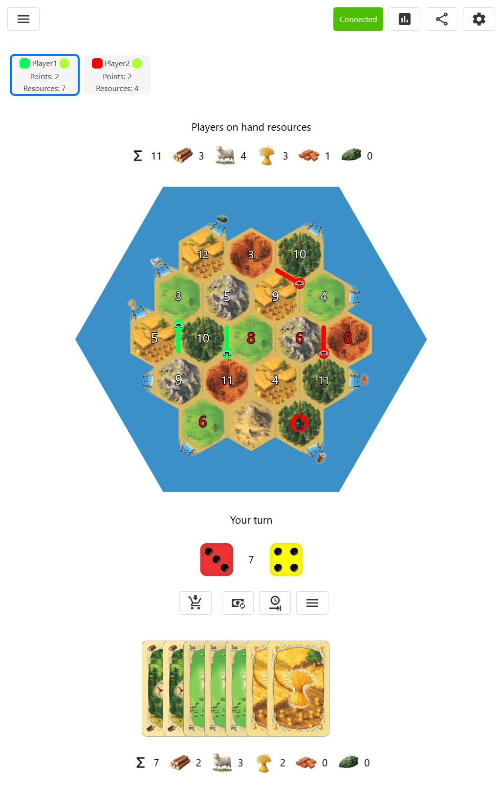

# Boardgames Web Based Engine

Web based boardgames engine



To run:
- Run nodejs SEA executable (no nodejs installed required). Download (sea-os-version.zip) from [releases](https://github.com/HMHamster88/boardgame-web-ts/releases), unzip and run "boardgame-web-ts-server" executable
- Run with nodejs. Download (bundled-version.zip) from [releases](https://github.com/HMHamster88/boardgame-web-ts/releases), unzip and run 
```
node app.mjs
```
- Build and run with nodejs
```
npm install
npm run build-all
npm run start
```
After start default games will be downloaded from github ([Catan](https://github.com/HMHamster88/boardgame-web-catan), [Cards against humanity](https://github.com/HMHamster88/boardgame-web-cah), [Ticket to Ride](https://github.com/HMHamster88/boardgame-web-ticket-to-ride))

## Games
- [Catan](https://github.com/HMHamster88/boardgame-web-catan)
- [Cards against humanity](https://github.com/HMHamster88/boardgame-web-cah)
- [Ticket to Ride](https://github.com/HMHamster88/boardgame-web-ticket-to-ride)